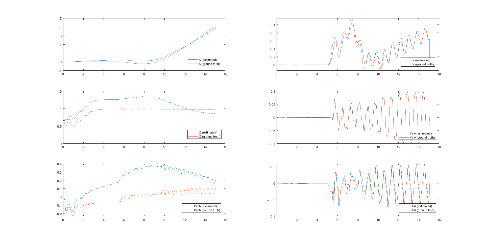
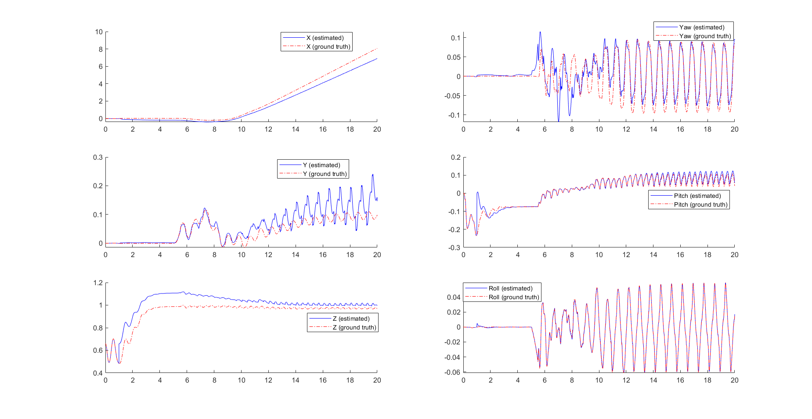
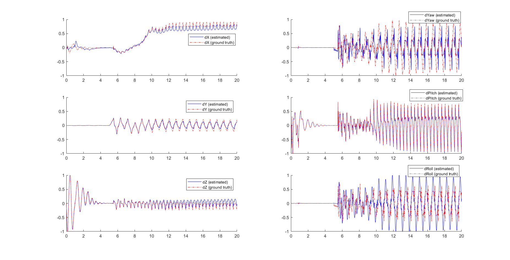

# Dynamic State Estimation
ROB530 Project Winter 2021

In this project we implement and compare several types of algorithms for state estimation of the Cassie robot from Agility Robotics. 

### QP Estimators

Formulating state estimation as an optimization problem that can be solved with Quadratic Programming (QP) makes it easy to handle equality and 
inequality constraints on the dynamical system. We provide an implementation of [\[1\]](https://ieeexplore.ieee.org/document/6942679) adapted for the 
Cassie robot under **QPv1**. However, we find that the different sensor configuration of Cassie compared to the Atlas robot from Boston Dynamics (on which this method was originally evaluated) make it ill-suited for use on the Cassie robot.

We also derive a second QP formulation from the Cassie dynamics model using a different state vector formulation and implement it, under **QPv3**. This method provides significantly better state estimation for the Cassie robot, due to the fact that it directly estimates the robot state (rather than just the velocity) and it is more suited to the available sensors on Cassie.

### EKF as MAP problem with holonomic constraints eliminated

We obtain the dynamics of the base link by eliminating the ground-reaction forces via SVD. 

### Baseline InEKF Estimators

Finally, we implement the state-of-the-art Invariant EKF for the Cassie robot[\[2\]](https://arxiv.org/abs/2104.04238) for provide a baseline comparison for the performance of our estimators under **InEKF_IMU_Kin.m**.

## Getting Started

Requirements
* MATLAB with MATLAB Coder and Optimization Toolboxes installed
* C compiler (if running on Linux or Mac)

Cassie Dynamics are provided in the form of pre-compiled Mex files. These files are compiled for Windows, so they must be recompiled to run on Mac or Linux.
The C source files are also included in the repository.

### Running the Code

The first step to running the estimator is to package the data in the format expected by the estimators. Add the `utils/` and `kin/` folders to your path in Matlab, then run

```matlab
proceed_data;
```

#### Quadratic Programming State Estimator

The QP-based state estimator can be run by adding the `QPv3/` folder to your path in Matlab, then running

```matlab
qp_v3
```

## Results
Below we present some results for the state estimation from the QPv3 implementation, using data generated from SimuLink and the FlatGround Controller for Cassie



Below are some results for the baseline InEKF method:





### Video Link

https://www.youtube.com/watch?v=lctm7weGKYU

## Contributors

The team working on this project comprises of:

- Sangli Teng

- Adam Goertz [](https://www.linkedin.com/in/adam-goertz-288532138/) [](https://github.com/AdamGoertz)

- Haoran Cheng [](https://www.linkedin.com/in/hrcheng/) [](https://github.com/hrchengmike)

- Santoshi Kulkarni [](https://www.linkedin.com/in/santoshi-kulkarni-08b19b19b) [](https://github.com/SantoshiK-skulk)

- Xiaofeng Lin [](https://www.linkedin.com/in/xiaofenglin) [](https://github.com/potBagMeat)
